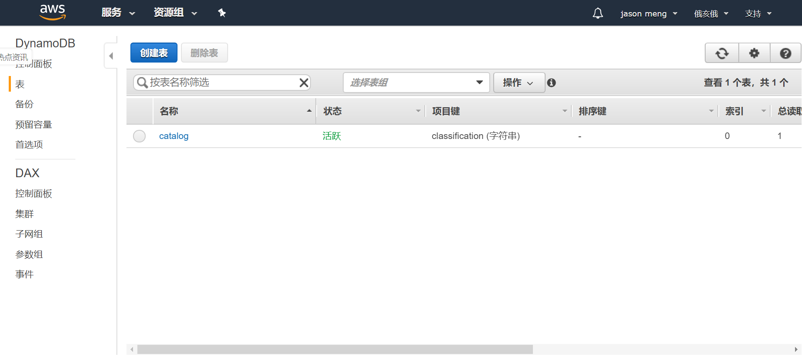
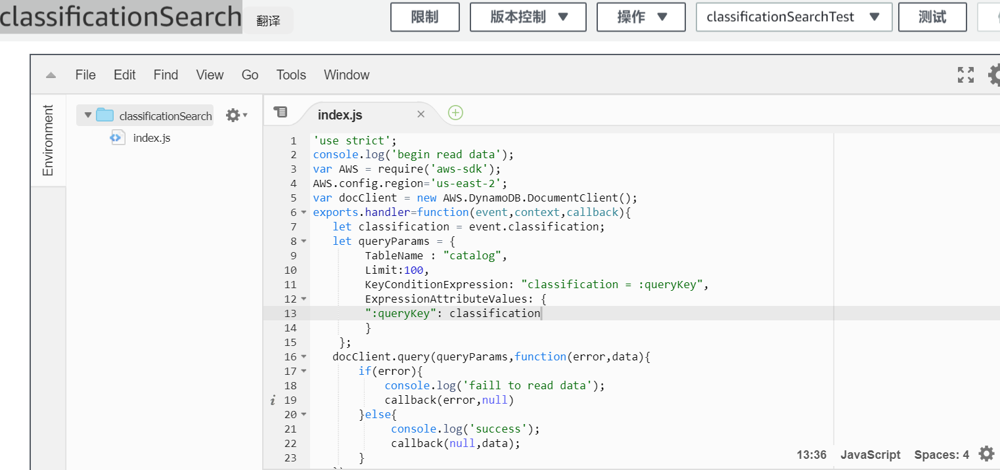
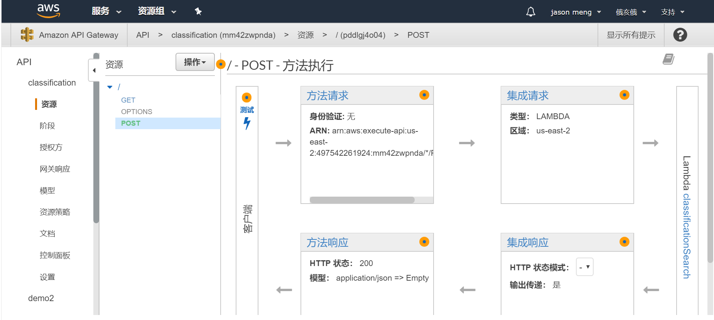
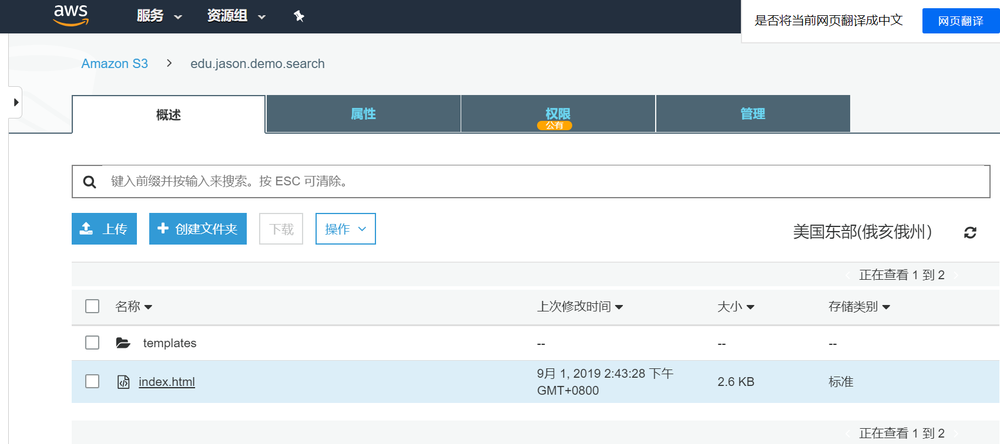

#1.需求分析
根据邮件内容，进行需求分析，概括如下,项目是为客户完成一个具有类似搜索功能的项目，通过关键字搜索，自动提示客户关联的相关信息，给用户友好的提示，
并且通过无服务架构，节约客户成本，做到快速上线。系统应具备一个搜索框，能够从后台搜索相关产品信息，并完成自动匹配，并在九月4号前给客户进行演示。
#2.系统设计说明
####2.1.本使用到了如下一些AWS服务及相关说明
本系统基于AWS无服务架构，通过S3+APIGateway+Lambda+DynamoDB搭建一个无服务的应用系统，通过IAM Role保证系统安全，通过Cloudwatch对系统进行监控。
1)数据库层采用AWS的DynamoDB，DynamoDB是一个文档型数据库，类似于memcache数据库。
2)利用AWS的Lambda服务进行业务处理，Lambda具有很好的弹性，灵活性特点，可以根据需要进行自动auto sacling,非常适合高并发场景，另外使用Lambda的好处就是可以按代码执行次数进行计费。通过配置IAM Role,Lambda就可以很好的访问DynamoDB了。
3)Web层选用Amazon S3服务，Amazon S3是AWS最古老的服务之一。Amazon S3是Amazon Simple Storage Service的简称。它是一个典型的Web服务，让用户可以通过HTTPS和API来存储和访问数据。基于以上，我们选用S3作为我们系统的WEB层，存储静态资源，用户可以通过https请求进行访问，在真实的生产环境中，我们可以使用AWS的Route53提供的域名服务给用户提供一个更加友好的访问网址。
4)当S3存储桶的静态资源，需要访问Lambda进行业务处理的时候，我们我们通过APIGateway技术做到了完美的结合，通过经典的RestFul格式请求，就完成了整个项目的功能。
5)系统运行时我们通过Cloudwatch进行系统运行日志监控。
####
本演示Demo采用简约方式进行演示,生产上可以生产架构[生产架构图](./images/production-servless.png "架构")
#3.开发步骤
####3.2.开通AWS账号
访问[亚马逊注册中心](https://portal.aws.amazon.com/billing/signup?redirect_url=https%3A%2F%2Faws.amazon.com%2Fregistration-confirmation&language=zh_cn#/start "亚马逊注册中心")开通账号，包含12个月的免费套餐，可以用来学习。
注意：开通账号需要信用卡信息，当资源使用完毕注意关闭资源，以免产生不必要的费用！
####3.3.创建DynamoDB表
1)Amazon DynamoDB 是一种提供快速与容许无缝扩展可预测性能的全管理型的非关系数据库服务。DynamoDB以键值存储的方式组织表里的数据。每个表包含了使用键（Key）来代表的项目（值）。一个表还可以包含二级索引，用来提供基于主键以外的数据查询功能。
2)登录到AWS的portal。选择DynamoDB服务，点击创建表的按钮进行表的创建

3)本项目创建的表包含一个Primary partition key:classification,文档示例如下
```
 {
  "classification": "鞋子",
  "contexts": [
    "鞋子理论是什么",
    "鞋子尺码",
    "鞋子品牌",
    "鞋子码数",
    "鞋子除臭",
    "鞋子尺码对照表"
  ]
}
```
####3.4.创建IAM Role
1)IAM（Identity and Access Management）服务通过AWS API提供身份认证与授权所需要的一切。你通过AWS API发送的每个请求都会通过IAM来检查这个请求是否被允许。IAM控制在你的AWS账户里，谁（身份
认证）能做什么（授权）。
2)选择IAM Role,创建新的IAM Role,该Role允许访问DynamoDB以及创建对表执行操作的权限，同时可以对CloudWatch Log进行日志写入。
####3.5.创建Lambda函数
进入AWS的portal，选择Lambda,创建一个基于Nodejs10的Lambda函数classificationSearch,根据用户传过来的搜索条件，搜索DynamoDB数据库中的记录，并返回给APIGateway。Execution role选择第2.4部创建的角色。
，可以在GIT上查看我的代码。
####3.6.配置APIGateway
配置APIGateway调用Lambda函数，并通过http协议将接口暴露出去。

配置APIGateway调用Lambda函数进行处理，将Lambda函数的处理结果返回给用户，配置APIGateWay时候，启用跨域访问。
####3.7.创建S3 bucket
创建S3 bucket,项目中将S3命名为edu.jason.demo.search，并将静态内容传到bucket中，S3中静态内容可以通过管理中心进行管理，也可以通过cli或者第三方语言维护，
通过配置将web内容通过url开放给用户访问。

Bucket规则如下：
```
{
    "Version": "2012-10-17",
    "Statement": [
        {
            "Effect": "Allow",
            "Principal": "*",
            "Action": "s3:GetObject",
            "Resource": "arn:aws:s3:::edu.jason.demo.search/*"
        }
    ]
}
```
####3.8 前台技术选择
本项目中静态部分采用vue框架，vue采用mvvm机制帮助我们进行数据和展现双向绑定，提高开发效率和增强使用体验，静态页面中，我们选用了CDN技术引入第三方的静态资源。
#4.功能演示
## Demo演示及地址

[Demo地址](http://edu.jason.demo.search.s3-website.us-east-2.amazonaws.com/ "Demo")


